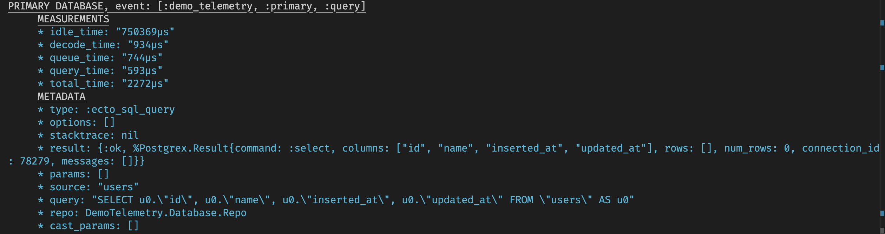
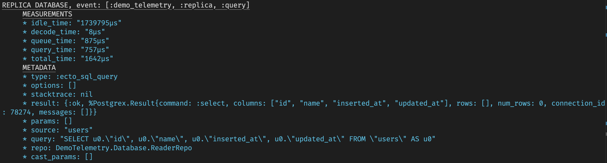
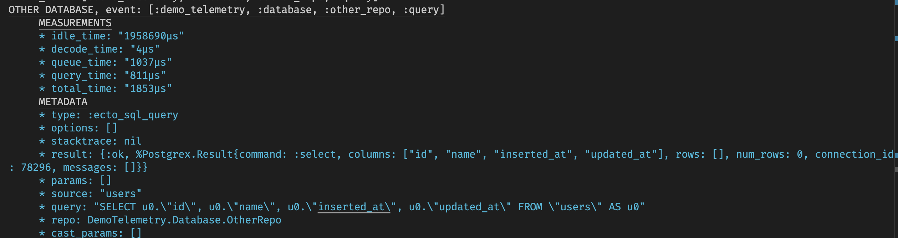
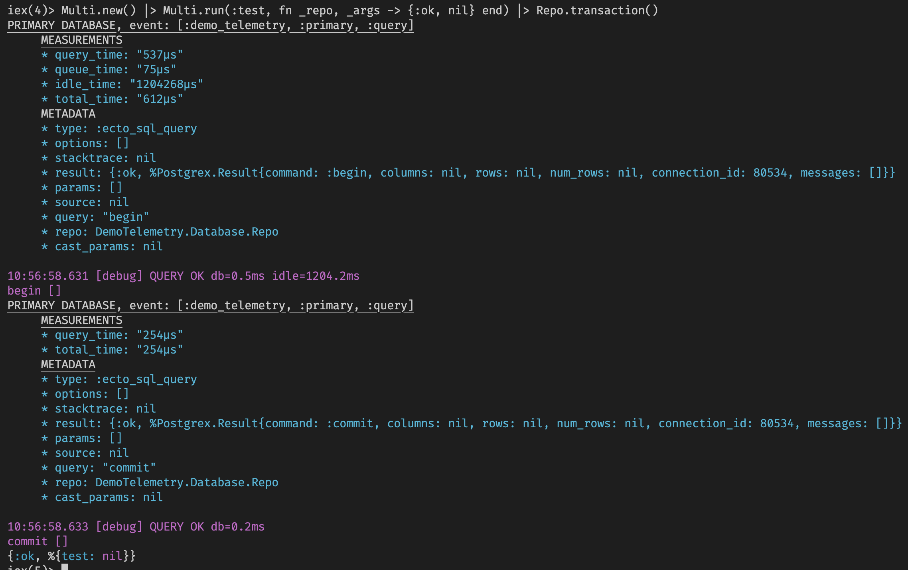
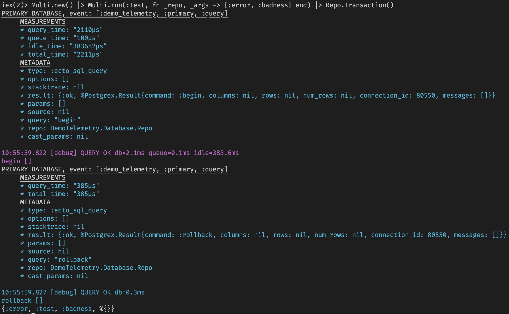
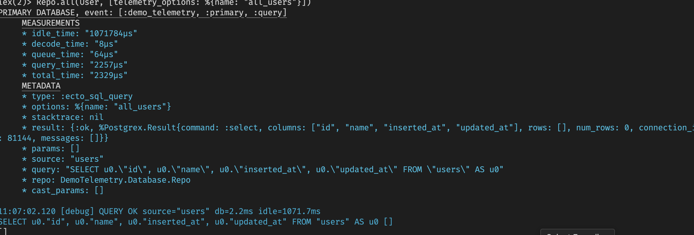
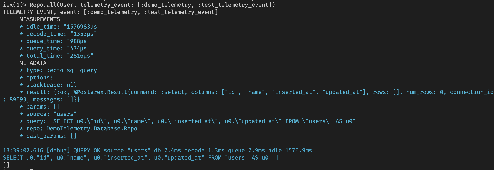

# DemoTelemetry

## Demonstrate Ecto Telemetry

- Search through your dependencies for the string `:telemetry.execute`. This is
  how an event is sent thru the telemetry system.
- The "important" event (the one you are probably interested in) for Ecto is
  generated by the [ecto_sql](https://hex.pm/packages/ecto_sql) library in
  the `ecto_sql/lib/ecto/adapters/sql.ex` file. This event is fired for
  every database activity.
- If you setup a repo with a telemetry prefix then the event name generated is
  the prefix you define concatenated with `[:query]`. If you do not define a
  telemetry prefix then Ecto uses the Repo module name (converted to a list of
  atoms) and concatenated with `[:query]` for the event name.
- For example, the example Repo in this project called `DemoTelemetry.Database.OtherRepo`
  generates the event `[:demo_telemetry, :database, :other_repo, :query]`. Note
  how the camel cased module name is converted snake-case.
- To register to receive events you take all the events you are interested in and
  call `:telemetry.attach_many`. You can see an example of this in
  `DemoTelemetry.Metrics.Instrumenter`.
- You have to be careful when you are processing events from the telemetry system.
  If your code raises an exception then your hook into the telemetry system is
  removed and you'll receive no more events.

## Steps

## Create Project

```
mix new --sup demo_telemetry
```

### Edit mix.exs and add dependencies

```
  {:telemetry, "1.3.0"},
  {:ecto_sql, "~> 3.12"},
  {:postgrex, ">= 0.0.0"},
  {:ex_machina, "~> 2.8", only: :test},
  {:faker, "~> 0.18.0", only: :test},
  {:credo, "~> 1.7", only: [:dev, :test], runtime: false},
  {:dialyxir, "~> 1.4", only: [:dev, :test], runtime: false}
```

### Generate a Repo

```
mix ecto.gen.repo -r DemoTelemetry.Database.Repo
mix ecto.gen.repo -r DemoTelemetry.Database.ReaderRepo
mix ecto.gen.repo -r DemoTelemetry.Database.OtherRepo
```

### Edit config.exs

Modify `DemoTelemetry.Database.Repo` and `DemoTelemetry.Database.ReaderRepo`
to set the `telemetry_prefix`. This can be used to override what Ecto uses
by default. The `DemoTelemetry.Database.OtherRepo` Repo module is setup
to use the default. All of these connect to the same database.

```
config :demo_telemetry, DemoTelemetry.Database.Repo,
  database: "demo_telemetry_repo",
  username: "fmcgeough",
  hostname: "localhost",
  telemetry_prefix: [:demo_telemetry, :primary]

config :demo_telemetry, DemoTelemetry.Database.ReaderRepo,
  database: "demo_telemetry_repo",
  username: "fmcgeough",
  hostname: "localhost",
  telemetry_prefix: [:demo_telemetry, :replica]

config :demo_telemetry, DemoTelemetry.Database.OtherRepo,
  database: "demo_telemetry_repo",
  username: "fmcgeough",
  hostname: "localhost"

config :demo_telemetry,
  ecto_repos: [DemoTelemetry.Database.Repo]
```

### Generate a Migration

```
mix ecto.gen.migration add_table
```

Edit the resulting file to add a simple `users` table.

```
defmodule DemoTelemetry.Database.Repo.Migrations.AddTable do
  use Ecto.Migration

  def change do
      create table(:users) do
        add :name, :string, size: 255

        timestamps()
      end
  end
end
```

### Create a Schema module for the users table

```
defmodule DemoTelemetry.Database.Schema.User do
  @moduledoc """
  users table schema
  """
  use Ecto.Schema

  import Ecto.Changeset

  alias __MODULE__

  schema "users" do
    field(:name, :string)

    timestamps()
  end

  def changeset(%User{} = user, params) do
    user
    |> cast(params, [:name])
  end
end
```

### Create an .iex.exs file

```
alias DemoTelemetry.Database.Repo
alias DemoTelemetry.Database.ReaderRepo
alias DemoTelemetry.Database.OtherRepo
alias DemoTelemetry.Database.Schema.User
import Ecto.Query
```

## Simple Tests

This shows the event data (including the event name) received when
interacting with each of the three repos defined in the project.

```
$ iex -S mix
iex> DemoTelemetry.Database.Repo.all(User)
```


```
iex> DemoTelemetry.Database.ReaderRepo.all(User)
```


```
iex> DemoTelemetry.Database.OtherRepo.all(User)
```


## Transactions and Ecto.Multi

```
iex> alias Ecto.Multi
iex> Multi.new() |> Multi.run(:test, fn _repo, _args -> {:ok, nil} end) |> Repo.transaction()
```



```
iex> alias Ecto.Multi
iex> Multi.new() |> Multi.run(:test, fn _repo, _args -> {:error, :badness} end) |> Repo.transaction()
```



## Identify Your Query

When you execute your query you can pass in telemetry_options as a final parameter. This lets
you pass on important information to your metrics handler. It's very important to do so. It
allows you to easily identify what SQL was executed (without attempting to parse the query
passed in the metadata). Note that transaction related operations - begin, commit, rollback - cannot
be named in this way. You will need to explicitly look for those strings in order to identify
them in your metrics.

iex> Repo.all(User, telemetry_options: %{name: "all_users"})



## Telemetry Event

Another option available is to use `:telemetry_event` when the database operation is done.
Personally I've never used this but it is available. This changes the event name. That
means that if you want to receive the event you must include the name in the list of
events you're listening for in call to `:telemetry.attach_many`.

Here's an example using `:telemetry_event`.

```
iex> Repo.all(User, telemetry_event: [:demo_telemetry, :test_telemetry_event])
```

The generated event name will be: `[:demo_telemetry, :test_telemetry_event, :query]`.


